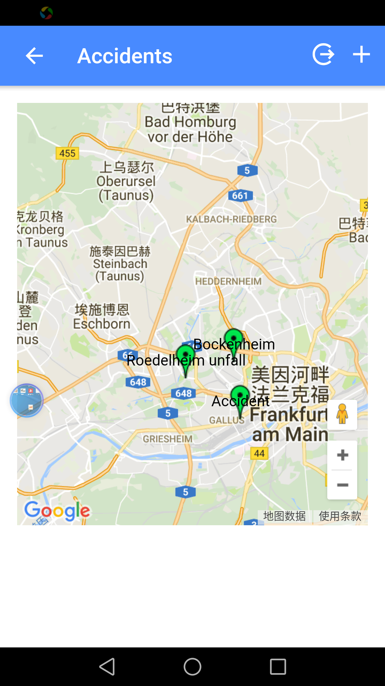
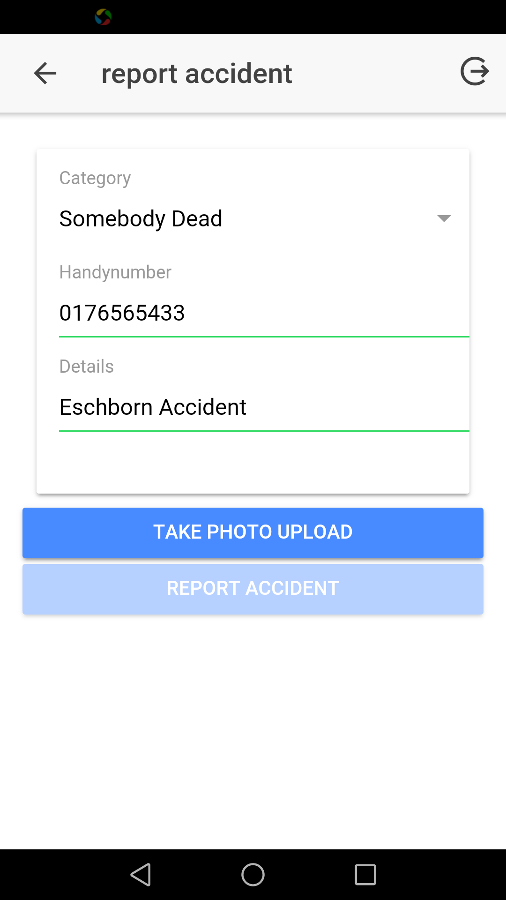
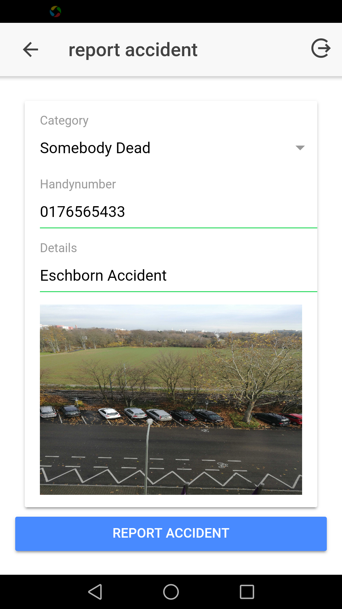
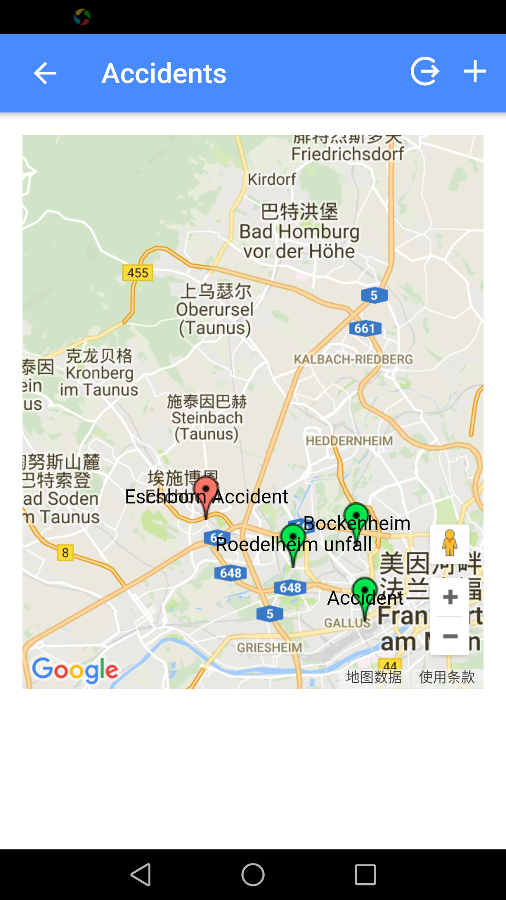
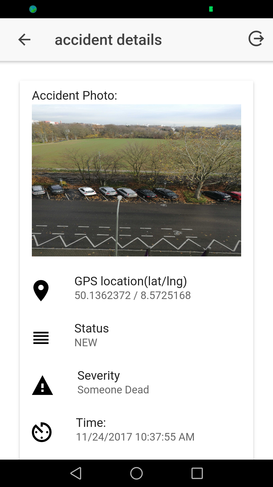

#hospital-booking

# Short Intro

`mapmi` is a map platform to report and view accident 

# generate icon and splash
 - https://blog.ionicframework.com/automating-icons-and-splash-screens/

# feature

 - list accidents
 - report accidents with photo and gps locations
 - show accident details
 
 
# install

- install[ionic framework](http://ionicframework.com) and cordova, with below commands

`
   npm install -g ionic cordova
`

- clone the project

`
  git clone https://github.com/stewchicken/mapmi.git
`

- run

`
  ionic platform add android
`

` ionic run android
`

or run `ionic serve` to view it on browser

# effects

- start app 

- list all reported accidents (green means nobody injured, yellow means injured, red means somebody dead)

- report accident, new accident will be listed on map automatically after reporting

- view accident details

 
 
